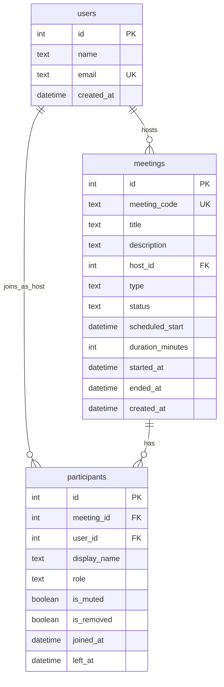

# zoom-clone — Video Conferencing Platform (Zoom Clone)

> All core flows built and deployed (T-001…T-027 complete). Backend tests green (`pytest tests/`); frontend tests green (`vitest run`); all pages rendered as a SPA-style App Router site.
>
> **No auth:** default Demo User (id=1) always logged in (no login/signup/token routes). No real audio/video — room shows initials tiles.

Functional Zoom web-app clone: create, join, and schedule meetings with a clean Zoom-like interface. Built as a Scaler SDE Fullstack assignment.

## Live demo
- App (frontend, Vercel): https://zoom-clone-one-pink.vercel.app
- API (backend, Render): https://zoom-clone-sl7i.onrender.com  (docs at /docs)
- Note: the backend is on Render's free tier. It sleeps when idle, so the first
  request can take 30-60 seconds. The SQLite database resets on restart and is
  re-seeded with demo data.

## Repository
https://github.com/himanshukumar19/zoom-clone

## Tech stack

| Layer | Choice |
|---|---|
| Frontend | Next.js App Router + TypeScript + Tailwind CSS (SPA-style, all pages client-rendered), Lato, lucide-react |
| Backend | Python FastAPI + SQLAlchemy 2.x + Pydantic v2 |
| Database | SQLite (own schema, auto-seeded on empty DB) |
| Runtime | Python 3.13.7 (3.11+ works if tested) |
| Hosting | Vercel (frontend) + Render (backend) |

## Features

All core flows complete (T-001…T-010 backend; T-009/T-010 frontend scaffold + API seam; T-011–T-027 pages and flows). Bonus responsive design included where practical.

| Feature | Status |
|---|---|
| Dashboard (clock, New / Join / Schedule tiles, Upcoming + Recent tabs) | complete |
| Instant Meeting (live room, 10-digit Meeting ID, Invite Link) | complete |
| Join Meeting (by ID or link + Display Name, not-found/ended errors) | complete |
| Schedule Meeting (topic, description, date/time, duration → Upcoming) | complete |
| Meeting Room (initials tiles, roster polling, self-mute, invite, leave) | complete |
| Host mute-all / remove participant (bonus) | complete |
| Responsive mobile/tablet/desktop (bonus) | included |

Built features (T-001…T-027): backend scaffold, env settings, SQLAlchemy engine/session with `PRAGMA foreign_keys=ON`, CORS from `CORS_ORIGINS`, health route; models + seed (Demo User, 3 upcoming + 4 ended meetings, dates relative to now, only when users empty); meeting code util (10-digit unique, spaced display); instant/schedule/end/get/start/join endpoints with lifecycle rules; leave with auto-end, participants list, self mute, identity header (`X-Participant-Id`); host-only mute-all and remove; full frontend App Router pages (dashboard, instant, join, schedule, meeting room, chat/contacts/settings placeholders, style guide).

## Repo layout

```
zoom-clone/
├── README.md
├── CONTEXT.md                  # domain glossary + locked decisions
├── AGENTS.md                   # repo rules for coding agents
├── docs/
│   ├── PROJECT_PLAN (1).md     # build spec (source of truth)
│   ├── adr/                    # 3 ADRs: tiles-only room, no-auth identity, early join
│   ├── specs/                  # 6 feature specs (00–05)
│   ├── tickets/                # T-001…T-027 implementation tickets
│   └── reference/              # Zoom UI screenshots (build reference)
├── backend/                    # FastAPI app — complete (models, seed, routers, tests)
│   ├── app/
│   │   ├── main.py             # app, CORS, startup hook (`/api/me`, `/api/health`)
│   │   ├── config.py           # env settings
│   │   ├── database.py         # engine, session, FK pragma
│   │   ├── models/             # user.py, meeting.py, participant.py
│   │   ├── schemas/ routers/ services/ utils/  # all routes + logic
│   │   └── seed.py             # relative seed on empty DB
│   ├── requirements.txt
│   └── .env.example
├── frontend/                   # Next.js App Router — complete (all flows + placeholders)
│   ├── app/                    # layout, dashboard, meeting, join, schedule, chat/contacts/settings placeholders
│   ├── components/ui/          # Button, Input, Select, Modal, Toast
│   ├── components/Wordmark.tsx # own text/SVG wordmark
│   ├── lib/                    # api.ts, session.ts, parseMeetingInput.ts (+ tests)
│   └── types/                  # Meeting / Participant / User
```

## Setup

Requires Python 3.11+ (project runs on 3.13.7; 3.11+ works if dependencies install).

Backend — clean clone:

```bash
cd backend
python -m venv .venv && source .venv/bin/activate
pip install -r requirements.txt
cp .env.example .env   # set FRONTEND_URL, CORS_ORIGINS (no trailing slash)
uvicorn app.main:app --reload
curl http://localhost:8000/api/health   # {"status":"ok"}
```

Startup runs `create_all` then seeds (Demo User + 3 upcoming / 4 ended meetings, dates relative to now) only when users table is empty. Reboots with data do not re-seed.

Frontend — clean clone:

```bash
cd frontend
npm install
cp .env.example .env.local   # set NEXT_PUBLIC_API_URL to backend URL
npm run dev                  # SPA-style App Router pages
npm run test                 # vitest (parser, session, API-error tests)
npm run typecheck            # tsc --noEmit
```

## Environment variables

Backend (`backend/.env.example`): `DATABASE_URL`, `FRONTEND_URL`, `CORS_ORIGINS`. `FRONTEND_URL` and `CORS_ORIGINS` must match the deployed Vercel domain (`https://...`, no trailing slash) so invite links work. `DATABASE_URL` uses SQLite file (`sqlite:///./zoom_clone.db`).

Frontend (`frontend/.env.example`): `NEXT_PUBLIC_API_URL` pointing at the backend (Render / local).

Never hardcode `localhost`; never commit `.env`, `.db`, or `.env.local` files.

## API

Base path `/api`, errors as `{ "detail": "..." }` (see `docs/specs/00-backend-foundation.md`).

| Method | Path | Purpose |
|---|---|---|
| GET | `/api/health` | Liveness check (Render warmup / QA) |
| POST | `/api/meetings/instant` | Create instant meeting + host participant → 201 `{meeting, participant}` (T-003) |
| POST | `/api/meetings` | Schedule meeting `{title, description?, scheduled_start, duration_minutes}` → 201 `{meeting}`, 422 on invalid/past input (T-004) |
| GET | `/api/meetings?filter=upcoming\|recent` | Dashboard lists per D13, newest first (T-004) |
| GET | `/api/meetings/{code}` | Validate a meeting exists (spaced codes accepted) → 200 or 404 (T-005) |
| POST | `/api/meetings/{code}/start` | Host starts a scheduled meeting → 200 `{meeting, participant}`, 410 if ended (T-005) |
| POST | `/api/meetings/{code}/join` | Join as guest with display name → 201 `{meeting, participant}`, 410 if ended, 422 invalid name, blocks removed-session rejoin (T-005) |
| POST | `/api/meetings/{code}/leave` | Leave; last active leave ends meeting → 200 `{ok: true}` (T-006) |
| GET | `/api/meetings/{code}/participants` | Active participants (roster poll) → 200 `[Participant]` (T-006) |
| PATCH | `/api/meetings/{code}/participants/me` | Toggle own mute → 200 `Participant` (T-006) |
| POST | `/api/meetings/{code}/end` | Host ends meeting for all → 200 `{ok: true}` or 403/410 |
| POST | `/api/meetings/{code}/mute-all` | Host-only: mute all non-host → 200 `{ok: true}` or 403 (T-007) |
| DELETE | `/api/meetings/{code}/participants/{id}` | Host-only: remove participant → 200 `{ok: true}` or 403/404 (T-007) |
| GET | `/api/me` | Default user for navbar avatar (`id=1`, Demo User) |

## ER diagram

`users` 1—N `meetings` (host); `meetings` 1—N `participants`; `users` 1—N `participants` (optional, host only). Active participant = `left_at IS NULL AND is_removed = false`.



See full endpoint table above (`/api/health`, instant, schedule, list, get/start/join/leave/end, participants, mute-self, mute-all, remove) — all implemented with lifecycle rules (D8/Q3) and host-only 403 enforcement.

## Assumptions (locked in grill / spec)

- **No auth**: one seeded Default User (id=1, name Demo User, email demo@example.com) is always "logged in". No login/signup/passwords/JWT/OAuth/protected routes (`GET /api/me` supplies navbar avatar only).
- **No real audio/video**: meeting room shows initials tiles; mute is a state flag (`is_muted`, toggled by self or host mute-all); roster refreshes by 5s polling (`GET .../participants`), no WebSockets or WebRTC.
- **Room identity is not security**: `sessionStorage` `participant_id` sent as `X-Participant-Id` header, used only for host-only checks (403 if not host). Anyone can forge it — business-rule input, not a credential.
- **Lifecycle / end rules**: meeting ends when host calls `POST .../end`; or when last active participant leaves (`POST .../leave`) plus a lazy expiry check; join on ended → 410.
- **Seed data**: random 10-digit codes (first digit non-zero, unique with retry), stored raw, displayed spaced; 3 upcoming + 4 ended meetings with dates relative to now; runs only when `users` table is empty.
- **Time**: stored UTC (`DateTime(timezone=True)`), serialized with `Z`, displayed in browser local zone.
- **Empty-state illustration**: `frontend/public/empty-meetings.png` (PNG, not SVG) — deliberate deviation.
- **Placeholder pages**: `/chat`, `/contacts`, `/settings`, `/meetings` are static placeholder pages for visual similarity; no backend/DB/work.
- **SQLite**: file-based (`zoom_clone.db`), `PRAGMA foreign_keys=ON`; ephemeral on Render (resets on restart/redeploy and is re-seeded with demo data).
- **Original work only**: own text/SVG wordmark (`components/Wordmark.tsx`); no copied Zoom logos/assets/code.

## Docs

- Build spec: `docs/PROJECT_PLAN (1).md`
- Glossary: `CONTEXT.md` · Decisions: `docs/adr/` · Specs: `docs/specs/` · Tickets: `docs/tickets/`
- Tracker mirror: `.scratch/` (all specs/tickets `ready-for-agent`)

## Progress

| Ticket | Scope | State |
|---|---|---|
| T-001 | Backend scaffold, config, DB session, CORS, health | done (`294d437`) |
| T-002 | Models + schema + seed | done (`1f20bfe`) |
| T-003 | Meeting code util + instant meeting endpoint | done (`2fc85a9`) |
| T-004 | Schedule endpoint + upcoming/recent list | done (`8fd997d`) |
| T-005 | Get-by-code, host start, guest join with lifecycle rules | done (`43b830b`) |
| T-006 | Leave with auto-end, participants list, self mute, identity header | done (`e41d905`) |
| T-007 | Host controls: mute-all, remove participant | done (`188f4cf`) |
| T-008 | Backend tests: schedule filters and host-only controls | done (`76e4cce`) |
| T-009 | Next.js + Tailwind scaffold, tokens, Lato, base UI components | done (`af2f74c`) |
| T-010 | Typed API client, session helper, meeting-input parser, types | done (`07e2b2a`) |

## Deployment

- **Backend (Render)**: root directory `backend/`; build `pip install -r requirements.txt`; start `uvicorn app.main:app --host 0.0.0.0 --port $PORT`; env vars: `DATABASE_URL` (SQLite file), `FRONTEND_URL`, `CORS_ORIGINS` (must equal deployed Vercel domain, https, no trailing slash), `PYTHON_VERSION` (3.13.7). `FRONTEND_URL` builds invite links (`https://zoom-clone-one-pink.vercel.app/join/{code}`).
- **Frontend (Vercel)**: root directory `frontend/`; env var `NEXT_PUBLIC_API_URL` points at the Render URL (`https://zoom-clone-sl7i.onrender.com`). No build-time backend fetches.
- Note: Render free tier sleeps when idle; first request may take 30–60 seconds. SQLite resets on restart and is re-seeded with demo data.
