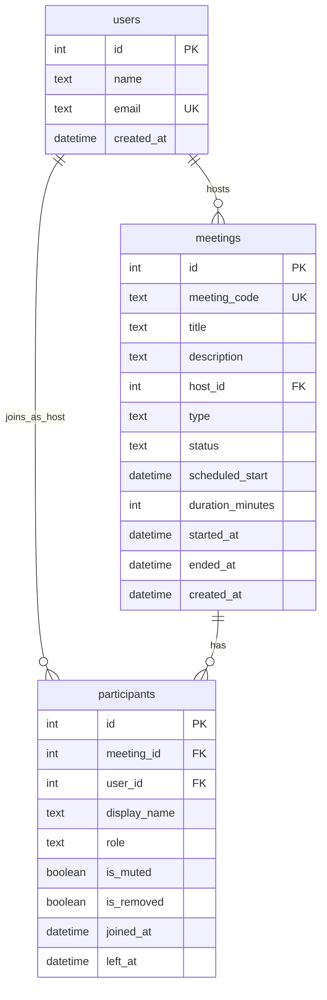
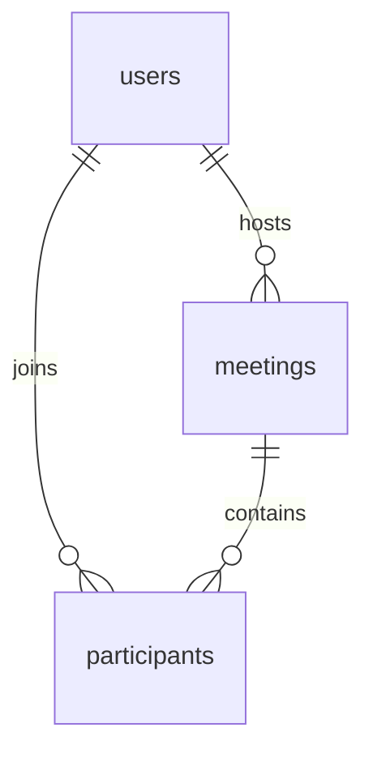

# zoom-clone — Video Conferencing Platform (Zoom Clone)

> **Status: in progress — 10 of 27 tickets done (T-001…T-010).** Backend complete (all endpoints + tests, `pytest tests/` green) with models + auto-seed on empty DB; frontend scaffold + API seam done (tested: `vitest run` green), all pages/flows still to come.
> Sections below are marked **[done]** or **[planned]** so you can tell what actually works. Deployed links TBD (T-024).

Functional Zoom web-app clone: create, join, and schedule meetings with a clean Zoom-like interface. Built as a Scaler SDE Fullstack assignment (1-day timeline).

## Tech stack

| Layer | Choice |
|---|---|
| Frontend | Next.js App Router + TypeScript + Tailwind CSS (SPA-style, all pages client-rendered), Lato, lucide-react |
| Backend | Python FastAPI + SQLAlchemy 2.x + Pydantic v2 |
| Database | SQLite (own schema, auto-seeded on empty DB) |
| Hosting | Vercel (frontend) + Render (backend) |

## Features

Status per feature — backend complete through T-008; frontend scaffold + API seam done (T-009, T-010); pages/flows still to come.

| Feature | Status |
|---|---|
| Dashboard (clock, New / Join / Schedule tiles, Upcoming + Recent tabs) | planned (T-011…T-013) |
| Instant Meeting (live room, 10-digit Meeting ID, Invite Link) | backend **[done]** (T-003); flow UI planned (T-014) |
| Join Meeting (by ID or link + Display Name, not-found/ended errors) | backend **[done]** (T-005); flow UI planned (T-015) |
| Schedule Meeting (topic, description, date/time, duration → Upcoming) | backend **[done]** (T-004); page UI planned (T-016) |
| Meeting Room (initials tiles, roster polling, self-mute, invite, leave) | backend **[done]** (T-006); room UI planned (T-017…T-019) |
| Host mute-all / remove participant (bonus) | backend **[done]** (T-007); room UI planned (T-020) |
| Responsive mobile/tablet/desktop (bonus) | planned (T-022) |

**[done] T-001 — backend scaffold:** env-driven settings, SQLAlchemy engine/session with `PRAGMA foreign_keys=ON`, CORS from `CORS_ORIGINS`, `GET /api/health`.

**[done] T-002 — models + seed:** `users` / `meetings` / `participants` with CHECK constraints (type/status/duration), unique indexed meeting code, cascade delete to participants; startup `create_all` + seed (Demo User, 3 upcoming + 4 ended meetings, dates relative to now) that runs only when the users table is empty.

**[done] T-003 — instant meeting:** `POST /api/meetings/instant` creates a `live` meeting titled `"Demo User's Meeting"` plus a host participant; 10-digit code (first non-zero, unique with retry), spaced display form, Invite Link computed from `FRONTEND_URL` (never stored). Covered by `backend/tests/test_instant_meeting.py` (5 tests).

**[done] T-004 — schedule + list:** `POST /api/meetings` validates title ≤200 (trimmed, non-empty), description ≤2000, future `scheduled_start`, `duration_minutes` > 0 → 201 `{meeting}` or 422 with `detail`; `GET /api/meetings?filter=upcoming|recent` implements D13 (Upcoming = not ended and not past scheduled end; Recent = ended or past end; missed unstarted meetings count as Recent), newest-first by `created_at`.

**[done] T-005 — get/start/join:** `GET /meetings/{code}` validates existence (404 unknown, spaced codes accepted); `POST /meetings/{code}/start` flips scheduled → live (410 on ended); `POST /meetings/{code}/join` trims/limits display name (422), returns 410 on ended, blocks removed-session rejoin, and first join flips scheduled → live (D8/Q3).

**[done] T-006 — leave/participants/mute:** `POST /meetings/{code}/leave` (last active leave ends the meeting), `GET /meetings/{code}/participants` (active only), `PATCH .../participants/me` (own mute toggle); caller identity via `X-Participant-Id`, 400 when missing.

**[done] T-007 — host controls:** `POST /meetings/{code}/mute-all` and `DELETE .../participants/{id}` enforce host-only (403 otherwise); host/self cannot be removed.

**[done] T-008 — backend tests:** `backend/tests/` covers code format/uniqueness, join/start lifecycle rules, upcoming/recent filters, leave auto-end, and host-only 403s (`pytest tests/` green).

**[done] T-009 — frontend scaffold:** Next.js App Router + TypeScript + Tailwind, Lato via `next/font`, Zoom design tokens (`app/globals.css`), base UI components (`components/ui/`: Button, Input, Select, Modal, Toast), text/SVG wordmark — no copied assets.

**[done] T-010 — frontend API seam:** typed client (`lib/api.ts`, `ApiError` with status for 404/410/422/403), `sessionStorage` participant identity keyed by code (`lib/session.ts`), pure `parseMeetingInput` (spaced/raw/link → code), shared types (`types/`). Tested: `npm run test` (`vitest run`, 12 tests) green, `npm run typecheck` clean.

## Repo layout

```
zoom-clone/
├── README.md
├── CONTEXT.md                  # domain glossary + locked decisions
├── AGENTS.md                   # repo rules for coding agents
├── docs/
│   ├── PROJECT_PLAN (1).md     # build spec (source of truth)
│   ├── adr/                    # 3 ADRs: tiles-only room, no-auth identity, early join
│   ├── specs/                  # 6 feature specs (00–05)
│   ├── tickets/                # T-001…T-027 implementation tickets
│   └── reference/              # Zoom UI screenshots (build reference)
├── backend/                    # FastAPI app  [exists]
│   ├── app/
│   │   ├── main.py             # app, CORS, startup hook
│   │   ├── config.py           # env settings
│   │   ├── database.py         # engine, session, FK pragma
│   │   ├── models/             # [done — T-002] user.py, meeting.py, participant.py
│   │   ├── schemas/ routers/ services/   # [done — T-003/T-004] instant, schedule, list
│   │   ├── utils/              # [done — T-003] meeting_code.py (generate/format/invite link)
│   │   └── seed.py             # [done — T-002] relative seed, runs when users empty
│   ├── requirements.txt
│   └── .env.example
├── frontend/                   # Next.js app  [scaffold + API seam done — T-009/T-010]
│   ├── app/                      # layout (Lato, Toast), dashboard placeholder, style-guide
│   ├── components/ui/            # [done — T-009] Button, Input, Select, Modal, Toast
│   ├── components/Wordmark.tsx   # [done — T-009] own text/SVG wordmark
│   ├── lib/                      # [done — T-010] api.ts, session.ts, parseMeetingInput.ts (+ tests)
│   └── types/                    # [done — T-010] Meeting/Participant/User types
```

## Setup

Backend **[done]** — verified on a clean Python 3.11+ venv (see `.python-version`):

```bash
cd backend
python -m venv .venv && source .venv/bin/activate
pip install -r requirements.txt
cp .env.example .env   # set FRONTEND_URL, CORS_ORIGINS (no trailing slash)
uvicorn app.main:app --reload
curl http://localhost:8000/api/health   # {"status":"ok"}
```

Startup runs `create_all` then seeds demo data when the users table is empty (Demo User + 3 upcoming / 4 ended meetings with dates relative to now). Reboots with data do not re-seed.

Frontend **[done — scaffold + API seam]**:

```bash
cd frontend
npm install
cp .env.example .env.local   # set NEXT_PUBLIC_API_URL to the backend URL
npm run dev                  # pages/flows land in T-011+
npm run test                 # vitest (parser, session, API-error tests)
npm run typecheck            # tsc --noEmit
```

## Environment variables

Backend (`.env.example`) **[done]**: `DATABASE_URL`, `FRONTEND_URL`, `CORS_ORIGINS`.
Frontend (`.env.example`) **[done]**: `NEXT_PUBLIC_API_URL`.
Never hardcode `localhost`; never commit `.env` or `.db` files.

## API

Base path `/api`, errors as `{ "detail": "..." }` (see `docs/specs/00-backend-foundation.md`).

**[done]**

| Method | Path | Purpose |
|---|---|---|
| GET | `/api/health` | Liveness check (Render warmup / QA) |
| POST | `/api/meetings/instant` | Create instant meeting + host participant → 201 `{meeting, participant}` (T-003) |
| POST | `/api/meetings` | Schedule meeting `{title, description?, scheduled_start, duration_minutes}` → 201 `{meeting}`, 422 on invalid/past input (T-004) |
| GET | `/api/meetings?filter=upcoming\|recent` | Dashboard lists per D13, newest first (T-004) |
| GET | `/api/meetings/{code}` | Validate a meeting exists (spaced codes accepted) → 200 or 404 (T-005) |
| POST | `/api/meetings/{code}/start` | Host starts a scheduled meeting → 200 `{meeting, participant}`, 410 if ended (T-005) |
| POST | `/api/meetings/{code}/join` | Join as guest with display name → 201 `{meeting, participant}`, 410 if ended, 422 invalid name, blocks removed-session rejoin (T-005) |
| POST | `/api/meetings/{code}/leave` | Leave; last active leave ends meeting → 200 `{ok: true}` (T-006) |
| GET | `/api/meetings/{code}/participants` | Active participants (roster poll) → 200 `[Participant]` (T-006) |
| PATCH | `/api/meetings/{code}/participants/me` | Toggle own mute → 200 `Participant` (T-006) |
| POST | `/api/meetings/{code}/mute-all` | Host-only: mute all non-host → 200 `{ok: true}` or 403 (T-007) |
| DELETE | `/api/meetings/{code}/participants/{id}` | Host-only: remove participant → 200 `{ok: true}` or 403/404 (T-007) |

**[planned]** — will add when T-011 implements it:
`GET /api/me` → 200 `{id, name, email}` for the navbar avatar placeholder.

## ER diagram

**[done — T-002]** `users` 1—N `meetings` (host); `meetings` 1—N `participants`; `users` 1—N `participants` (optional, host only). Active participant = `left_at IS NULL AND is_removed = false`.



## API (core)

- `GET /api/me` — default user
- `POST /api/meetings/instant` — create instant
- `POST /api/meetings` — schedule
- `GET /api/meetings?filter=upcoming|recent`
- `GET /api/meetings/{code}`
- `POST /api/meetings/{code}/start`
- `POST /api/meetings/{code}/join`
- `POST /api/meetings/{code}/leave`
- `POST /api/meetings/{code}/end` — host only
- `GET /api/meetings/{code}/participants`
- `PATCH /api/meetings/{code}/participants/me`
- `POST /api/meetings/{code}/mute-all` — host only
- `DELETE /api/meetings/{code}/participants/{id}` — host only

## Database (ER diagram)



## Assumptions (locked in grill)

- **No auth**: one seeded Default User (id=1, Demo User) is always "logged in". No login/signup/passwords/tokens/routes.
- **No real audio/video**: room shows initials tiles; mute is a state flag; roster refreshes by 5s polling, no WebSockets.
- **Room identity is not security**: frontend `sessionStorage` participant id sent as `X-Participant-Id`, used only for host-only checks (403 otherwise). Anyone can forge it — it is a business-rule input, not a credential.
- **Empty-state illustration**: uses user-supplied PNG (`frontend/public/empty-meetings.png`), not an SVG — deliberate deviation.
- **Placeholder pages**: `/chat`, `/contacts`, `/settings`, `/meetings` are static placeholder pages for visual similarity (no backend/DB work).
- Guests may join scheduled meetings before host Start (first join flips to live); join on ended → 410.
- SQLite on the host is ephemeral — seed re-runs on restart.
- Times stored in UTC, displayed in browser-local zone.
- Original work only: own text/SVG wordmark, no copied Zoom assets.

## Docs

- Build spec: `docs/PROJECT_PLAN (1).md`
- Glossary: `CONTEXT.md` · Decisions: `docs/adr/` · Specs: `docs/specs/` · Tickets: `docs/tickets/`
- Tracker mirror: `.scratch/` (all specs/tickets `ready-for-agent`)

## Progress

| Ticket | Scope | State |
|---|---|---|
| T-001 | Backend scaffold, config, DB session, CORS, health | done (`294d437`) |
| T-002 | Models + schema + seed | done (`1f20bfe`) |
| T-003 | Meeting code util + instant meeting endpoint | done (`2fc85a9`) |
| T-004 | Schedule endpoint + upcoming/recent list | done (`8fd997d`) |
| T-005 | Get-by-code, host start, guest join with lifecycle rules | done (`43b830b`) |
| T-006 | Leave with auto-end, participants list, self mute, identity header | done (`e41d905`) |
| T-007 | Host controls: mute-all, remove participant | done (`188f4cf`) |
| T-008 | Backend tests: schedule filters and host-only controls | done (`76e4cce`) |
| T-009 | Next.js + Tailwind scaffold, tokens, Lato, base UI components | done (`af2f74c`) |
| T-010 | Typed API client, session helper, meeting-input parser, types | done (`07e2b2a`) |

## Deployment (TBD — T-024)

- Frontend URL: TBD · Backend URL: TBD · Repo URL: https://github.com/himanshukumar19/zoom-clone
